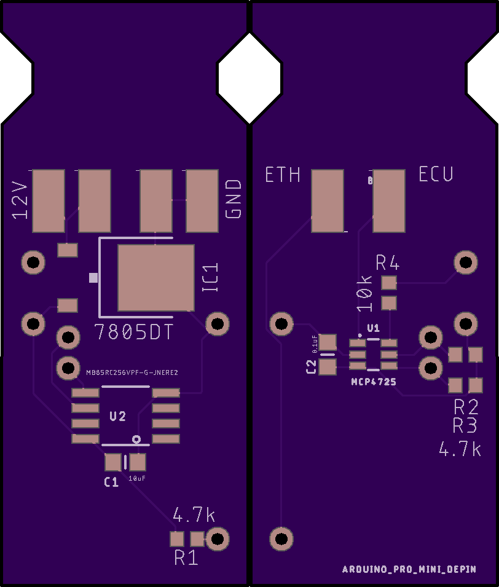

Arduino Ethanol Controller
--------------------------

This is Arduino software for an automotive ethanol fuel sensor controller.

The ethanol sensor is designed to give real-time readings of ethanol content
in fuel as a percentage between 0 and 100%. It outputs this as an FM signal
from 50-150Hz, with the ethanol content given by subtracting 50 from the
signal frequency. The sensor itself runs on 12V, but outputs a 5V signal.
It also outputs fuel temperature readings, which are not used in this
project.

When adding an ethanol sensor to a vehicle that does not already support flex
fuel, there is unlikely to be an ECU input natively compatible with the
sensor's FM output. Instead, only a 0-5V analog input will be available. This
project converts the sensor signal to a voltage that the ECU can accept.

# Features

* Converts 50-150Hz square wave FM to a 0.5-4.5V signal
* Voltages below 0.5V and above 4.5V are used for error states (can be used to set DTC)
* "Sane" ethanol values within milliseconds of power-on from persistent memory

# Design

Depends on 16MHz/5V Arduino. CPU frequency is assumed fixed, with timing values computed
from CPU ticks.

This code assumes you are using an [I2C 12-bit DAC](https://www.sparkfun.com/products/12918) 
and a [I2C FRAM](https://www.adafruit.com/product/1895). Those links are to the breakout
boards used in prototyping this project's hardware. If you use those boards, be aware that
both of them have I2C pullup resistors. It is recommended that you desolder the pullup
resistors from the Adafruit board.

The FRAM chip/board may be omitted without altering the software. This will only affect 
the first fraction of a second after power up but before the sensor's 
readings have stabilized.

Electrical connection is simple. Wire the I2C lines, in parallel, to SDA/SCL of the Arduino.
The breakout boards can be stacked and soldered on a pair of header pins on the I2C, and short
wires for power. The breakout boards must be powered at 5V.

Wire the ethanol sensor to D8, with a 4.7kOhm pullup resistor in parallel. The ethanol sensor
should be powered at 12V.

Wire the DAC output to the ECU input.

